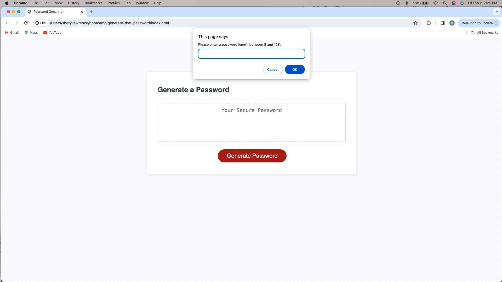
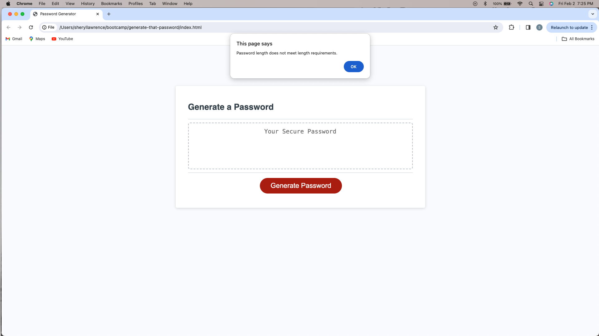
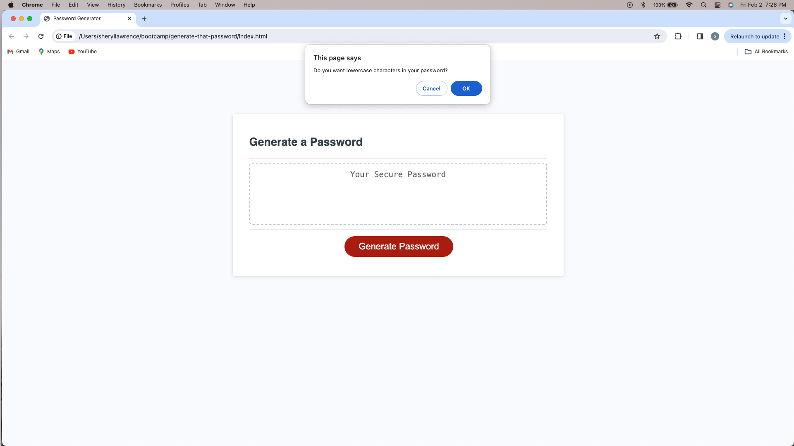
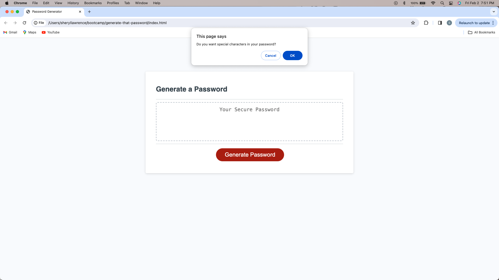
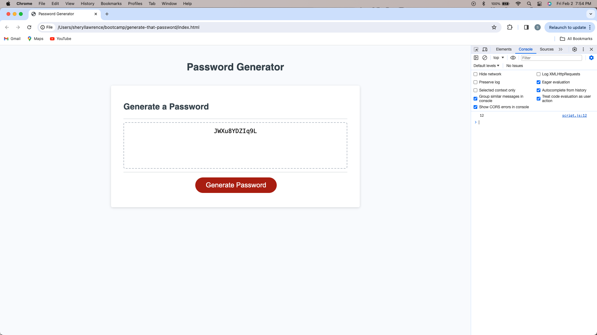

# generate-that-password
A Password Generator Website

## Description 

- The motivation for this project was security. 
- Through the implementation of Javascript and a few confirmations, a user can create a strong and secure password, that will provide greater security for sensitive data. 
- Challenges occurred in the process of refactoring code, especially to include all the criteria, and then having the website generate a password. 
- Utilizing JavaScript concepts and writing the code itself was initially difficult. The syntax also created challenges since it often caused, what was the correct, code not to execute. 
- Through the making of this website I learned a lot about JavaScript and especially, and more specifically, functions. I learned how to use functions to provide interactivity to the user while providing prompts and confirmations on the page. 
- The making of this project also helped me better understand JavaScript syntax. Subsequently, the trial and errors of this project may have also helped with my JavaScript practice. 

## Usage

- To use this website all that is needed is a browser and an internet connection. Once the URL is placed in the brower the website will open.

- No authentications are needed to access the website.

- Once on the website, to generate a password, the user clicks on the red 'Generate Password' button. The user will then be asked to enter a password length between 8 and 128. If the answer provided does not meet the length requirements then the user will receive a message stating so and will be returned to the password length prompt. Next, the user will be asked to confirm four criteria for their password, if they would like lowercase, uppercase, symbols and/or numbers. Once the user has gone through these confirmations a password will be generated with the users specifications. There is no limit to the number of passwords that can be generated.

[x] https://slawcode.github.io/generate-that-password/ [y]

## Credits

Foolish Developer. (2022, June 2). Random Password Generator Using Javascript. Dev. https://dev.to/code_mystery/random-password-generator-using-javascript-6a

MDN Web Docs. (n.d.). Math.random().https://developer.mozilla.org/en-US/docs/Web/JavaScript/Reference/Global_Objects/Math/random

Nyakundi, Hillary. (2021, December 8). How to Write a Good Readme File for Your GitHub Project. FreeCodeCamp. https://www.freecodecamp.org/news/how-to-write-a-good-readme-file/

Paul Keldsen - Web Development. (2021, September 13). Homework Startup Guide: Javascript Password Generator [Video]. YouTube. https://www.youtube.com/watch?v=x4HUaiazDes 

The Code Chic. (2023, May 31). Javascript Random Password Generator Tutorial [Video]. YouTube. https://www.youtube.com/watch?v=TG61_iDMO9A 

University of Toronto. (2023). Coding Boot Camp [Source Code].