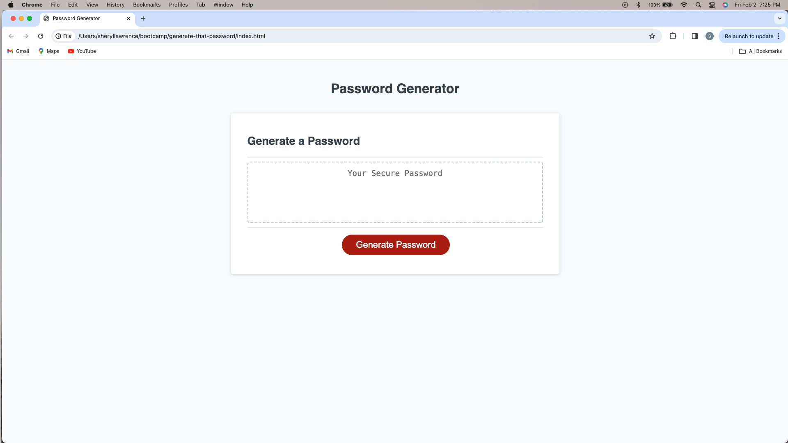

# generate-that-password
A Password Generator Website

## Description 

- The motivation for this project was security. 
- Through the implementation of Javascript and a few prompts, a user can create a strong and secure password, that will provide greater security for their sensitive data. 
- Challenges occurred in the process of refactoring code, especially to include all the criteria, and having it generate a password. 
- Utilizing the correct JavaScript rules was also a challenge in the refactoring of code. 

## Usage

- To use this website all that is needed is a browser and an internet connection. Once the URL is placed in the brower the website will open.

- No authentications are needed to access the website.

- To use the website to generate a password, once loaded in the browser, the user simply clicks on the red 'Generate Password' button.

[x][y]

## Credits

Foolish Developer. (2022, June 2). Random Password Generator using Javascript. Dev. https://dev.to/code_mystery/random-password-generator-using-javascript-6a

MDN Web Docs. (n.d.). Math.random().https://developer.mozilla.org/en-US/docs/Web/JavaScript/Reference/Global_Objects/Math/random

Nyakundi, Hillary. (2021, December 8). How to Write a Good Readme File for Your GitHub Project. FreeCodeCamp. https://www.freecodecamp.org/news/how-to-write-a-good-readme-file/

Paul Keldsen - Web Development. (2021, September 13). Homework Startup Guide: Javascript Password Generator [Video]. YouTube. https://www.youtube.com/watch?v=x4HUaiazDes 

The Code Chic. (2023, May 31). Javascript Random Password Generator Tutorial [Video]. YouTube. https://www.youtube.com/watch?v=TG61_iDMO9A 

University of Toronto. (2023). Coding Boot Camp [Source Code].